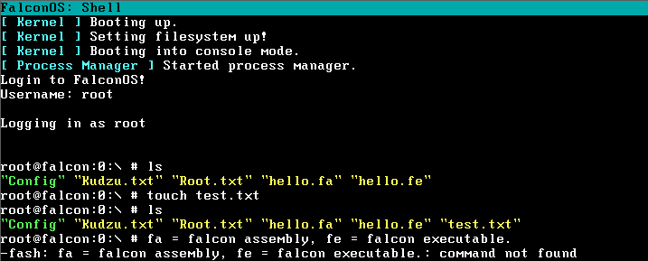
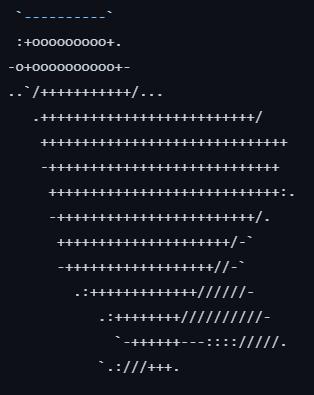

Highly advanced OS, focuses on pure command line. (but better)

 
  
  
  
  
  
  

## Logo:

## Features:
- Very Stable filesystem
- FAV (text editor copied from MIV but its better which itself is copied from VIM which is based on VI)
- A semi-proper user system
- FalCompile (a compiler not fully made but work in progress)
- a very good shell with a lot of commands
- sudo System
- Executable support (.fe [Falcon Executable])
- Custom Assembly (.fa [Falcon Assembly])

## Building
### Requires: Visual Studio, VMWare, Cosmos UserKit and The Source File
### To Build:
- Open VS Studio
- Open the .sln source file
- Run it
- And done!
